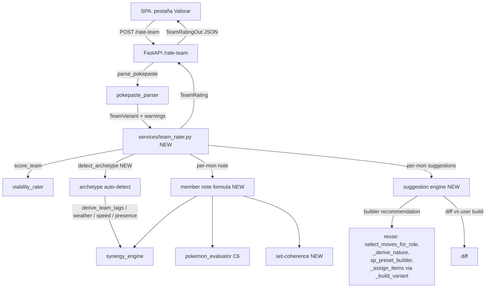

# ADR — Team Rater ("Valorar un equipo introducido por el usuario")

- **Status:** Proposed
- **Date:** 2026-05-31
- **Author:** Sola (Solution Architect)
- **Branch suggestion:** `feat/team-rater`
- **Related:** `docs/adr-vgc-scoring.md` (C2/C3/C6), `docs/adr-weather-setter-coherence.md`,
  `docs/adr-move-category-coherence.md`. Builds on the additive-overlay model defined there.

---

## 0. Context

The builder today goes *favorite → generated team*. This feature inverts the flow:
the user **pastes their own team** (PokePaste) and the app **valora** it. The roster
is FIXED — we never propose swapping or removing a Pokémon. We only propose tuning
**item / moveset / nature / EVs** per mon.

Outputs required:

1. Nota global del equipo (0–100).
2. Por CADA Pokémon, una **nota 1–100** de su "valor en el equipo".
3. Puntos fuertes y débiles (equipo + por mon).
4. Sugerencias concretas (el cambio específico: naturaleza X, EVs Y, item Z, move A→B).

Decisions already locked by the user (NOT re-litigated here):

- Surface = Web UI (SPA Alpine) + FastAPI endpoint. CLI optional/secondary.
- Strategy/arquetipo = **auto-detected** from the team itself.
- Suggestions = **concrete**, not generic advice.

### 0.1 What already exists (verified in code, 2026-05-31)

The existing `POST /import` (`api/router.py:323`) ALREADY does the first half of this:
it calls `pokepaste_parser.parse_pokepaste` → `viability_rater.score_team` →
`generate_explanation`, and serializes via `_variant_to_out`. **The team rater is a
superset of `/import`**: same parse + global score, PLUS per-mon notes + per-mon
suggestions + auto-detected archetype.

This is the single most important architectural fact: **we do not duplicate the import
path. We add a service that consumes a parsed `TeamVariant` and produces the richer
rating.** `/import` stays untouched (it has its own tests); the new endpoint calls the
same parser and then the new rater.

**[HIGH] Reuse confidence:** every function named in the reuse map was located and read.
Signatures confirmed below.

---

## 1. Guiding principles

1. **Additive, never destructive.** No public signature changes; the 534 tests stay green.
   SP=66/32, items pool, the 7 archetypes, and the 7 role labels are untouched. Same
   discipline as the three prior ADRs (roles are dict keys → never renamed).
2. **Maximum reuse.** The rater orchestrates existing services; the only genuinely NEW
   logic is (a) archetype auto-detection, (b) the per-mon **set-coherence** signal, and
   (c) the **diff** between the user's build and the builder's recommendation.
3. **Roster is sacred.** The suggestion engine is structurally incapable of proposing a
   species change — it only ever recomputes item/moveset/nature/EVs *for the same
   `PokemonData`*.
4. **Never invent competitive data.** Notes are computed from existing data files and
   deterministic services. Anything not derivable is flagged `[UNCERTAIN]` and weighted
   conservatively, never fabricated.

---

## 2. Architecture overview



The new module `services/team_rater.py` is a **pure orchestrator + two new local
computations** (member note, suggestions). It sits ABOVE `viability_rater`,
`synergy_engine`, `pokemon_evaluator`, `replica_exporter`, and `team_generator` and
imports from them — never the reverse (no circular-import risk; mirrors the layering
discipline from `docs/adr-vgc-scoring.md` §2.1).

---

## 3. Auto-detection of strategy / archetype

### 3.1 Signals (all already computed by existing services)

We classify a `TeamVariant` into one of the 7 archetypes
(`hyper_offense | hard_trick_room | bulky_offense | weather_based | stall | balance |
perish_trap`) from these signals, all reused:

| Signal | Source (reuse) | What it tells us |
|---|---|---|
| Per-member doubles tags | `synergy_engine.derive_team_tags(variant)` → `list[list[str]]` | `offensive_threat`, `support_enabler`, `speed_control`, `defensive_pivot`, `weather_setter`, `weather_abuser`, `trick_room_setter`, `trick_room_abuser` |
| Weather present | count of `weather_setter` tags + `derive_team_tags` `weather_abuser` | weather_based |
| Trick Room present | count of `trick_room_setter` + `trick_room_abuser` tags | hard_trick_room |
| Speed control credit | `viability_rater._count_speed_control(members)` | structural |
| Offensive presence | per-mon `assess_presence(...).has_offensive_stat` | hyper_offense vs bulky/stall |
| Defensive bulk | per-mon wall role weights via `assign_role_weights` | bulky_offense / stall |
| Perish | `perish-song` present in any moveset | perish_trap |

### 3.2 Classification rule (deterministic, ordered)

`detect_archetype(variant: TeamVariant) -> tuple[str, float]` returns
`(archetype, confidence)`, `confidence ∈ [0,1]`. Ordered checks, first match wins
(VGC archetypes are not mutually exclusive — we pick the dominant one):

1. **hard_trick_room** — ≥1 `trick_room_setter` tag AND ≥2 members with `spe ≤ 60`.
   (Mirrors the existing `detect_role_gaps` `slow_trio` rule.)
2. **weather_based** — ≥1 `weather_setter` tag AND ≥1 `weather_abuser` tag on a *different*
   member (a setter with no abuser is incidental, not the strategy).
3. **perish_trap** — `perish-song` in any moveset (perish is never incidental in M-A).
4. **hyper_offense** — ≥4 members with `offensive_threat` AND `_count_speed_control ≥ 1`.
5. **stall** — ≥3 members are `defensive_pivot` OR pure walls, AND ≤1 `offensive_threat`.
6. **bulky_offense** — 2–3 `offensive_threat` AND ≥1 `defensive_pivot`.
7. **balance** — fallback (the `get_weights` default; weights all 1.0).

**Confidence** = fraction of members whose tags are consistent with the chosen archetype
(e.g. for weather_based: `(setters + abusers) / 6`). Low confidence (`< 0.4`) → we STILL
score under the detected archetype but surface `[UNCERTAIN]` in the UI ("Estrategia
detectada: lluvia (confianza baja)"), so the user can mentally adjust.

**[UNCERTAIN]** The exact thresholds (≥4 for HO, ≥3 for stall) are starting points marked
in code, calibrated by a non-regression test that runs `detect_archetype` over a corpus
of fixture teams (one per archetype) — same calibration discipline as
`pokemon_evaluator` §4.2. We do NOT invent meta usage data; thresholds are structural.

### 3.3 Why auto-detect instead of asking

The user locked this. Architecturally it is also cleaner: the detected archetype feeds
BOTH the global score (`score_team(variant, archetype=detected)`) AND the per-mon
fit term, so a single classification drives everything. If we let the user pick, the
"fit" note would contradict a team that doesn't actually match the chosen archetype.

---

## 4. Per-Pokémon note (1–100)

### 4.1 The three components (user's definition)

The user defined the note as a blend of **(a) set coherence/quality of the concrete
build**, **(b) intrinsic value (C6)**, and **(c) fit/synergy with the detected strategy**.
We model each on [0,1] then weight.

```
note_mon = round(100 * clamp(
      W_FIT       * fit
    + W_INTRINSIC * intrinsic
    + W_COHERENCE * coherence
    , 0.0, 1.0))
clamped to [1, 100]  # the user asked for 1–100, never 0
```

#### Component (c) — `fit` ∈ [0,1] — synergy + role adequacy with the detected strategy

The largest weight: the user said the note is primarily "cuánta sinergia aporta y cuán
adecuado es su papel dentro de la estrategia". Reuses:

- `assess_presence(pokemon, moves, ability).presence_weight` — is this mon a threat or
  disruption at all (C2)? A passive liability scores `fit ≈ 0`.
- Tag-match: does the mon's `derive_doubles_tags` output contain a tag the **team needs**
  for the detected archetype? Needed-tags table per archetype (NEW small static map,
  derived from §3 signals — e.g. weather_based *needs* `weather_setter` and
  `weather_abuser`; hyper_offense *needs* `offensive_threat` and `speed_control`).
  A mon supplying a needed tag the team is short on scores high; a redundant mon scores
  mid; an off-strategy mon scores low.
- Contribution to coverage/speed/weather — reuse the *marginal* contribution:
  `analyze_coverage(team)` with vs without this mon's moves (does removing it open an
  offensive gap?); `_member_speed_control(member)`; weather match from `derive_team_tags`.

`fit = 0.4*presence_weight + 0.4*tag_need_match + 0.2*marginal_contribution`
(weights `[UNCERTAIN]`, tuned by fixture tests).

#### Component (b) — `intrinsic` ∈ [0.5,1.0] — species-level value (C6)

Direct reuse: `pokemon_evaluator.evaluate_pokemon_quality(member.pokemon).score`. This is
already species-level [0.5,1.0] and already used by the global scorer's
`_quality_adjustment`. We reuse it verbatim — **no new intrinsic logic**.

#### Component (a) — `coherence` ∈ [0,1] — quality of the CONCRETE set (NEW signal)

C6 is species-level; the user explicitly called out that the **concrete build the user
typed** (their EVs/nature/moveset) is a NEW signal to design. This is where the recent
coherence work (`adr-move-category-coherence`, `adr-weather-setter-coherence`) pays off:
we already know how to detect an incoherent set. The coherence score starts at 1.0 and
subtracts deterministic penalties, each computed by reusing existing primitives:

| Penalty | Detection (reuse) | Magnitude |
|---|---|---|
| **Dead move** (the Abomasnow ice-beam bug class): an attacking move whose category contradicts the nature/EV investment | `replica_exporter._MOVE_CATEGORY[move]` vs `_dominant_attack_category(moves)` (`team_generator.py:1023`) vs the nature's boosted stat | −0.15 each, cap −0.30 |
| **Nature ↔ moveset mismatch**: user's nature boosts the stat the moveset doesn't use | compare `member.nature` to `_derive_nature(primary, roles, moves)` (`team_generator.py:1051`) | −0.10 |
| **EV waste**: SP invested in an offensive stat the moveset never uses (atk SP on all-special set, or the reverse) | `member.sp_distribution` vs `_dominant_attack_category(moves)` | −0.10 |
| **SP not maxed**: total SP < `MAX_SP_TOTAL` (66) | sum of `sp_distribution` vs `config.MAX_SP_TOTAL` | −0.05 |
| **No STAB**: zero damaging moves of the mon's own type | `_MOVE_TYPE` over `moves` ∩ `pokemon.types` | −0.10 |
| **Choice/setup conflict** etc. | existing guards in `select_moves_for_role` | −0.05 |

These are exactly the invariants the builder already enforces when GENERATING; here we
INVERT them into a checklist applied to the user's parsed set. **No new game knowledge —
we reuse the category/nature/STAB primitives that already exist.**

`coherence = clamp(1.0 - Σ penalties, 0.0, 1.0)`.

### 4.2 Weights

```
W_FIT       = 0.50   # user: "principalmente" sinergia + adecuación de rol
W_COHERENCE = 0.30   # concrete build quality (the new signal)
W_INTRINSIC = 0.20   # species ceiling (C6)
```

**[UNCERTAIN]** Weights are a defensible starting point (fit dominant per the user's
wording), tuned by fixture tests, not by invented data. They live as module constants
with a `# [UNCERTAIN] calibrate` marker, like `pokemon_evaluator`'s penalty constants.

### 4.3 Why this composition is sound

- It cannot exceed 100 or drop below 1 (clamp + floor).
- A great species (high C6) with an incoherent set (dead move, wasted EVs) is correctly
  penalised — exactly the user's "valor propio... moveset equilibrado y coherente".
- A mediocre species that is the perfect glue for the strategy (e.g. a redirect support
  on hyper_offense) still scores well via `fit` — matching "cuánta sinergia aporta".
- It reuses the SAME `assess_presence`/C6 signals the global score uses, so a mon's note
  and the team note never tell contradictory stories.

---

## 5. Suggestion engine (item / moveset / nature / EVs — NEVER species)

### 5.1 Core idea: builder-recommendation diff

For each member we compute what the BUILDER would recommend **for the same species, same
detected archetype**, then diff against the user's set. The diff IS the suggestion. This
guarantees concreteness ("Naturaleza: Brave → Adamant", "EVs: +252 Atk", "Item: Leftovers
→ Scope Lens", "Move: Ice Beam → Icicle Crash") and structurally cannot suggest a species
change (we recompute over `member.pokemon`).

### 5.2 Recommendation reuse map (verified signatures)

| Field | Recommendation source (reuse) |
|---|---|
| **Moveset** | `replica_exporter.select_moves_for_role(pokemon, member.role, item=member.item, meta_moves=..., archetype=detected, team_sheet=variant.team_sheet)` — returns the 4 moves the builder would pick. Already category-coherent post `adr-move-category-coherence`. |
| **Nature** | `team_generator._derive_nature(primary, member.role, recommended_moves)` — coherent with the recommended moveset's category. |
| **EVs (SP)** | `team_generator.suggest_sp_distribution(pokemon, primary)` as baseline, then `sp_preset_builder.build_presets(member, item, nature)["offensive"]` for the refined 66-SP spread (same call `_build_variant` uses). |
| **Item** | Reuse `team_generator._assign_items([roles], [pokemon], preview_moves=[recommended_moves], meta_items_by_member=[...])[0]`. This honours role default, C5 frail-attacker berry (`_frail_attacker_resist_berry`), legality, and Choice guards — exactly the generator's logic. |

**Important:** these are *private* helpers (`_derive_nature`, `_assign_items`,
`suggest_sp_distribution` is public). The team_rater imports them within the package
(same package, allowed). We do NOT change their visibility or signature. If Tecle/Deva
prefer a public seam, the minimal additive option is a thin public wrapper
`team_generator.recommend_member_build(pokemon, roles, archetype, team_sheet) -> RecommendedBuild`
that internally calls the existing privates — **additive, no behavior change** to
existing call sites. (Recommended: add this wrapper; it keeps `team_rater` from reaching
into another module's privates and is one clean test target.)

### 5.3 Diff → suggestion rules

For each field, emit a `Suggestion` only when the diff is *material*:

- **Move swap:** user has move M in slot i, recommendation has M' (different) of the
  same role intent. Emit `move_swap` with reason. Special-case the **dead-move** finding
  from §4.1 → high-priority suggestion ("Ice Beam es especial pero tu naturaleza/EVs son
  físicos; cámbialo por Icicle Crash o ajusta la naturaleza"). Do NOT spam: only suggest
  swaps that the coherence checker flagged OR that close a team coverage gap
  (`analyze_coverage` before/after).
- **Nature:** user nature ≠ recommended nature AND the user's nature boosts an unused
  stat → suggest the recommended nature.
- **EVs:** user spread wastes SP on an unused offensive stat, or total < 66 → suggest the
  recommended preset spread (`sp_preset_builder` offensive preset).
- **Item:** user item ≠ recommended item AND (user item is illegal in M-A per
  `_load_champions_legal_items`, OR recommended item strictly dominates for the mon's
  role/berry need). Be conservative: many items are sidegrades — only suggest when there
  is a clear reason (illegal item, missing frail-attacker berry, Choice-lock conflict).

Each `Suggestion` carries `{kind, target_field, from, to, reason_es, priority}`.
`priority` orders the UI list (dead move > illegal item > wasted EVs > sidegrade).

### 5.4 Strengths / weaknesses

**Per mon** (`MemberRating.strengths/weaknesses`): derived from the same signals, phrased
in Spanish:
- Strengths: high `fit` ("pieza clave de la estrategia de lluvia"), high C6, coherent set
  (no penalties), needed-tag supplier, closes a coverage gap.
- Weaknesses: passive liability (`assess_presence` flags), C6 flags
  (`QualityReport.flags` reused verbatim — e.g. "stats ofensivas partidas"), each
  coherence penalty reason, redundant role.

**Per team** (`TeamRating.strengths/weaknesses`): reuse `generate_explanation(variant,
score)` as the baseline prose, augmented with the detected archetype, the
`requires_speed_control` flag (`viability_rater.variant_requires_speed_control`), passive
liabilities count (`_count_passive_liabilities`), and weather/TR coherence.

---

## 6. Data model

New dataclasses in `services/team_rater.py` (frozen, mirroring `QualityReport` /
`PresenceReport` style). These are SERVICE-layer types; API schemas (§7) are separate
Pydantic models (existing pattern: domain/service types ≠ API `*Out` schemas).

```python
@dataclass(frozen=True)
class Suggestion:
    kind: str               # "move_swap" | "nature" | "evs" | "item"
    target_field: str       # "slot_2" | "nature" | "sp_distribution" | "item"
    from_value: str         # human-readable current value
    to_value: str           # human-readable recommended value
    reason_es: str          # concrete Spanish explanation
    priority: int           # 0 = highest

@dataclass(frozen=True)
class MemberRating:
    name: str               # pokemon.name (species, for display only)
    score: int              # 1..100
    fit: float              # [0,1] component (debug/UI breakdown)
    intrinsic: float        # [0.5,1.0] component (C6 score)
    coherence: float        # [0,1] component
    strengths: list[str]
    weaknesses: list[str]
    suggestions: list[Suggestion]

@dataclass(frozen=True)
class TeamRating:
    score: float            # 0..100 (reuses score_team)
    detected_archetype: str
    archetype_confidence: float    # [0,1]; UI shows [UNCERTAIN] if low
    strengths: list[str]
    weaknesses: list[str]
    members: list[MemberRating]    # index-aligned with the parsed variant
    import_warnings: list[str]     # passthrough from parse_pokepaste
```

### 6.1 Public service signature

```python
def rate_team(variant: TeamVariant, import_warnings: list[str] | None = None) -> TeamRating: ...
# plus the helper, testable in isolation:
def detect_archetype(variant: TeamVariant) -> tuple[str, float]: ...
def rate_member(variant: TeamVariant, index: int, archetype: str) -> MemberRating: ...
```

`rate_team` orchestrates: `detect_archetype` → `score_team(variant, archetype=...)` →
`rate_member` per index → assemble strengths/weaknesses. Pure (no network): the parser
already resolved `PokemonData` (including `meta_service` only inside the recommendation
path, which degrades gracefully to `[]` exactly as `_build_variant` does).

---

## 7. FastAPI endpoint

New route in `api/router.py`, new schemas in `api/schemas.py`. Mirrors the existing
`/import` shape so the SPA reuses its plumbing.

### 7.1 Request

```
POST /rate-team
{ "pokepaste": "<texto pegado>" }
```

```python
class RateTeamRequest(BaseModel):
    pokepaste: str = Field(min_length=1)
```

### 7.2 Response

```python
class SuggestionOut(BaseModel):
    kind: Literal["move_swap", "nature", "evs", "item"]
    target_field: str
    from_value: str
    to_value: str
    reason: str          # Spanish
    priority: int

class MemberRatingOut(BaseModel):
    name: str
    score: int           # 1..100
    fit: float
    intrinsic: float
    coherence: float
    strengths: list[str] = []
    weaknesses: list[str] = []
    suggestions: list[SuggestionOut] = []

class TeamRatingOut(BaseModel):
    score: float
    detected_archetype: str
    archetype_confidence: float
    strengths: list[str] = []
    weaknesses: list[str] = []
    members: list[MemberRatingOut]
    import_warnings: list[str] = []
```

### 7.3 Handler (reuses the `/import` parse path verbatim)

```python
@router.post("/rate-team", response_model=TeamRatingOut)
def rate_team_endpoint(req: RateTeamRequest) -> TeamRatingOut:
    try:
        variant, warnings = pokepaste_parser.parse_pokepaste(req.pokepaste)
    except ValueError as exc:
        raise HTTPException(status_code=422, detail=str(exc)) from exc
    rating = team_rater.rate_team(variant, import_warnings=warnings)
    return _team_rating_to_out(rating)
```

Same error contract as `/import` (422 on parse/legality/species-clause errors). 500 only
on unexpected internal errors. No new failure modes introduced.

---

## 8. SPA integration (Alpine) — minimal, no over-design

The SPA already has an **Import** tab calling `/import` (`app.js:306 importTeam()`,
`importedVariants`). The Valorar feature is a **sibling tab** that reuses the same paste
textarea pattern:

- Add state: `ratePaste`, `rateLoading`, `rateError`, `teamRating` to the `app()` object.
- Add `async rateTeam()` — POSTs to `/rate-team`, stores `teamRating = data`.
- New template section `#rate-section` in `index.html`:
  - Paste textarea + "Valorar" button (copy the import section markup).
  - Team header: big global score, detected archetype badge (reuse the existing archetype
    badge component used by `VariantOut.archetype`), confidence note (show "(confianza
    baja)" when `archetype_confidence < 0.4`).
  - Team strengths/weaknesses lists.
  - Per-mon cards (reuse the existing member-card layout / `spriteUrl(name)`): show the
    1–100 note as a colored ring/badge, strengths/weaknesses, and a suggestions list with
    `from → to` and reason.

No new JS framework, no new component library. We reuse `spriteUrl`, the archetype badge,
and the member-card CSS already in `style.css`. **[LOW] risk** — purely additive UI.

CLI (optional/secondary): a `rate` command that reads a PokePaste file/stdin and prints
the `TeamRating` via Rich — thin wrapper over `team_rater.rate_team`. Defer unless asked.

---

## 9. Tests to add

New file `tests/test_team_rater.py` (does NOT touch existing test files):

1. **detect_archetype** — one fixture team per archetype → asserts the label. Includes a
   low-confidence case asserting `confidence < 0.4`. (Calibration test, like
   `test_pokemon_evaluator`'s pool sweep.)
2. **coherence penalties** — a deliberately incoherent set (physical nature + all-special
   moveset; Abomasnow with Ice Beam) → asserts the dead-move penalty fires and a
   `move_swap` suggestion is produced. A clean generated team → coherence ≈ 1.0, zero
   suggestions of `kind=move_swap` for dead moves.
3. **note bounds** — every `MemberRating.score ∈ [1,100]`; team `score ∈ [0,100]`.
4. **roster invariant** — assert NO suggestion has `kind` outside
   `{move_swap, nature, evs, item}` (no species swap is structurally possible).
5. **suggestion concreteness** — every suggestion has non-empty `from_value`, `to_value`,
   `reason`.
6. **reuse-consistency** — a freshly *generated* team (via `generate_team`), round-tripped
   through `to_pokepaste` → `parse_pokepaste` → `rate_team`, scores high and yields few/no
   suggestions (the builder's own output should not be told it's wrong). **[UNCERTAIN]**
   round-trip fidelity depends on the `SPs:`/`EVs:` paste variant — see
   `reference_champtteams_pokepaste`; gate this test on round-trip parity, verify with a
   real paste before asserting exact equality.
7. **endpoint** — FastAPI `TestClient` POST `/rate-team` happy path + 422 on a 5-mon
   paste. Mirror `test_*` import endpoint tests.
8. **recommend wrapper** (if added §5.2) — `team_generator.recommend_member_build`
   returns the same moveset/nature/item as the generator path for a known fixture.

### 9.1 Hard constraints (regression gates)

- The 534 existing tests MUST stay green. No public signature changes
  (`parse_pokepaste`, `score_team`, `select_moves_for_role`, `_derive_nature` keep their
  current signatures — we only ADD `recommend_member_build` if chosen).
- Do NOT touch: `MAX_SP_TOTAL`/`MAX_SP_STAT`, `champions_legal_items.json`, the 7
  archetypes, the 7 role labels, `archetype_weights.json`.
- `count` assertions: per `feedback_bulk_data_count_tests` there is no bulk-data change
  here, so no count tests to bump — but Deva should grep for any test asserting the set of
  API routes / endpoint count and update it in the SAME block that adds `/rate-team`.

---

## 10. Block order for Deva (atomic, each leaves the suite green)

| Block | Scope | Depends on | Reversible |
|---|---|---|---|
| **B0** | `detect_archetype(variant)` in `team_rater.py` + its fixtures/test. Pure, no other code touched. | — | ✅ |
| **B1** | `recommend_member_build` thin public wrapper in `team_generator.py` (additive; calls existing privates) + test that it equals the generator path. | — | ✅ |
| **B2** | Set-**coherence** scorer (the §4.1 checklist) as a pure helper `_set_coherence(member, variant) -> (float, list[reason])`. Reuses `_MOVE_CATEGORY`/`_dominant_attack_category`/`_derive_nature`. Test against the Abomasnow dead-move case. | B1 | ✅ |
| **B3** | `rate_member` — composes fit (assess_presence + tag-need + marginal coverage) + intrinsic (C6) + coherence (B2). Note formula + bounds tests. | B0,B2 | ✅ |
| **B4** | Suggestion engine — diff user build vs `recommend_member_build` (B1) → `list[Suggestion]`, priority-ordered. Roster-invariant + concreteness tests. | B1,B2 | ✅ |
| **B5** | `rate_team` orchestrator — archetype (B0) → `score_team` → `rate_member` (B3) → suggestions (B4) → team strengths/weaknesses (reuse `generate_explanation`). | B0,B3,B4 | ✅ |
| **B6** | FastAPI `/rate-team` route + schemas + `_team_rating_to_out`. Endpoint tests. | B5 | ✅ |
| **B7** | SPA: Valorar tab (state + `rateTeam()` + `#rate-section` markup, reusing member-card + archetype badge). | B6 | ✅ |

B0 and B1 are independent and can run in parallel. Per
`feedback_inte_before_static_data`: the only static-data-ish artifact is the
**needed-tags-per-archetype** map in §4.1; it is DERIVED from the §3 signals (not new
competitive data), so it lives in code as a constant — no Inte research blocker. If Deva
finds it needs a meta-usage source to set thresholds, STOP and route to Inte (do not
invent numbers).

---

## 11. Trade-offs & alternatives considered

| Decision | Chosen | Alternative | Why |
|---|---|---|---|
| Reuse `/import` parse path | Yes, new endpoint calls `parse_pokepaste` directly | Extend `/import` response with ratings | Keeps `/import`'s existing tests/contract stable; rating is a strict superset better served by its own route. |
| Note = weighted 3-component blend | fit 0.50 / coherence 0.30 / intrinsic 0.20 | Single black-box score | User explicitly named the three ingredients; a transparent blend lets the UI show *why* a mon scored low and is testable per-component. |
| Suggestions = builder-diff | Recompute builder recommendation, diff | Hand-written rule engine | Diff reuses ALL the generator's hard-won coherence/legality logic; a parallel rule engine would drift from the generator and re-introduce the dead-move class of bugs. |
| Archetype auto-detect | Deterministic ordered classifier | ML / usage-stats | No data for ML; deterministic + confidence is honest and testable. |
| `recommend_member_build` public wrapper | Add it (additive) | Reach into `_derive_nature`/`_assign_items` from team_rater | One clean public seam, one test target, avoids cross-module private coupling. Low cost. |

---

## 12. Risks & open questions

- **[RISK] Threshold calibration.** §3.2 archetype thresholds and §4.2 note weights are
  `[UNCERTAIN]` starting points. Mitigation: fixture-corpus calibration tests; constants
  centralized and commented; never fabricated from "meta knowledge."
- **[RISK] PokePaste round-trip fidelity.** The Champions `SPs:`/`EVs:` variant omits
  IVs/Level (`reference_champtteams_pokepaste`). The parser divides EVs by 8
  (`_evs_to_sps`). A team generated by us, exported, re-imported, and rated should not be
  told its own EVs are wasted. Mitigation: B-test #6 gates on round-trip parity; verify
  against a REAL paste before asserting (`feedback_external_paste_format_check`).
- **[RISK] `assign_role` on parsed members is species-level.** `parse_pokepaste` calls
  `assign_role(pokemon)` (full learnset), so a member's `role` may not reflect the 4 moves
  the user actually chose. The coherence and fit terms therefore prefer the *assigned
  moves* over the role label where possible (we already pass `moves=` to `assess_presence`
  / `derive_doubles_tags`). Flagged so Deva uses the move-aware overloads, not the role.
- **[RISK] Item-suggestion noise.** Many items are sidegrades; over-suggesting erodes
  trust. Mitigation: §5.3 only suggests items on a clear reason (illegal / missing berry /
  Choice conflict). Conservative by default.
- **[DECISION NEEDED]** Should low-confidence archetype detection (`< 0.4`) instead fall
  back to scoring under `balance` (all-1.0 weights) rather than the detected label? Scoring
  under a wrongly-detected niche archetype could unfairly punish a balanced team. Lean:
  **fall back to `balance` for the global score when confidence < 0.4, but still SHOW the
  detected label as a hint** — needs a one-line product call before B5.
- **[UNCERTAIN]** Whether `meta_service` should be consulted in the recommendation path
  (it is, inside `_build_variant`/`select_moves_for_role` via `meta_moves`). It degrades
  to `[]` offline, so suggestions remain deterministic-enough; but two runs could differ
  if meta cache changes. Acceptable for advisory output; document in the UI ("sugerencias
  orientativas").

---

## 13. Recommended next steps

1. Product call on §12 `[DECISION NEEDED]` (balance fallback for low confidence).
2. Deva executes B0→B7 in order (B0∥B1 parallel). Each block: implement → tests green →
   stop.
3. After B5, run the full 534-test suite as a regression gate before touching the API/UI.
4. Verify PokePaste round-trip against a real Champions paste (Inte/Sergio) before
   asserting B-test #6 equality.
